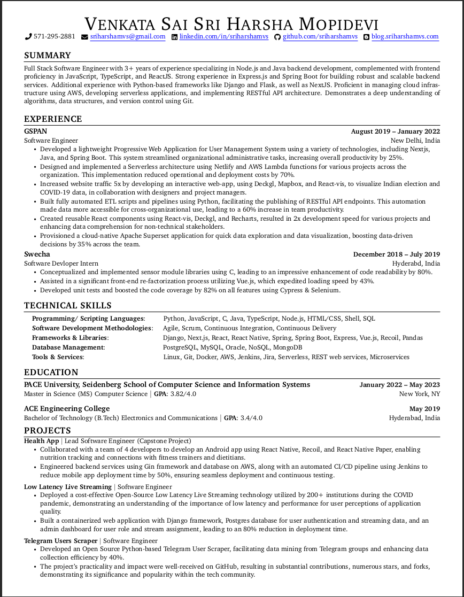

# Resume

A Single page resume for software developers using latex.

This contains different sections:

- Summary

- Experience

- Technical Skills

- Projects

- Education

- Volunteering

## Quick start

- Create an account in [Overleaf](https://www.overleaf.com/).

- Create a **New Project** then select **Blank Project** and give it a name.

- Replace the content in `main.tex` with the `Sriharsha_Mopidevi.tex`.

- Now Recompile it and download the PDF.

## Preview

